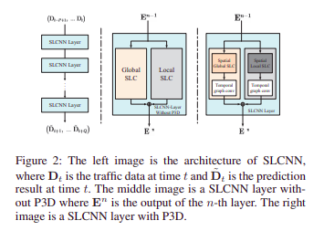

# Spatio-Temporal Graph Structure Learning for Traffic Forecasting

 1. Uses Structure Learning Convolution (extension of convolutions) to campture the graph structure. 
 STL uses the ChebNet operator to learn The global structure and the local structure of the graph. 
 The ChebNet operator is a kernel like structure that operated with the inputs of the node and passed
 through a non linearity, returns the outputs of the graph nodes.
 
 2. Uses Pseudo three dimensional convolution to capture temporal dependencies. 
 ??
 
 
 
 ---
 # Attention Based Spatial-Temporal Graph Convolutional Networks for Traffic Flow Forecasting
 
 1. 